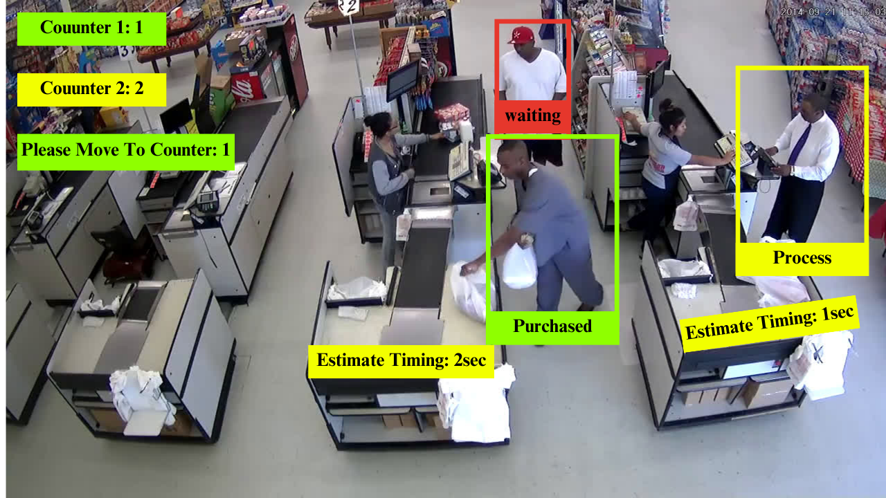

# SMART Counter

Welcome to the SMART Counter repository! This project aims to revolutionize retail operations by implementing a cutting-edge system for monitoring customer checkout times and optimizing queue management in retail shops.

## Overview

The SMART Counter System leverages computer vision technology to track customer interactions at checkout counters and intelligently manage queues. By accurately monitoring transaction durations and queue lengths in real-time, the system aims to enhance operational efficiency and improve customer satisfaction.

## Key Features

- **Real-Time Checkout Monitoring:** Accurately detects individuals at checkout counters and tracks their transaction durations.
- **SMART Queue Management:** Dynamically monitors queue lengths and directs customers to the next available counter for efficient flow.
- **Customer Engagement Analytics:** Tracks customer interactions within the store to gain insights into product preferences and behaviors.
- **Product Interaction Tracking (working on):** Monitors customer engagement with specific products to understand purchase intent and preferences.
- **Comparison Intelligence (working on):** Analyzes customer behavior to identify instances of product comparison and provide personalized recommendations.

